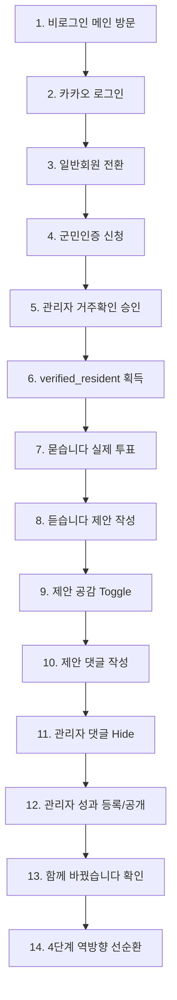

# 영광군의회 「열린소통 ON」 V4 서비스 종합 E2E 시연 시나리오 가이드

본 문서는 영광군의회 실무자 시연 및 운영 검증을 위해 설계된 14단계 풀-스택 E2E 시연 가이드입니다.

---

## 1. 사전 준비 및 역할 분리

| 구분 | 설명 | 접속 URL / 주요 작업 |
| :--- | :--- | :--- |
| **시민 시연 계정** | 카카오 소셜 로그인 완료 계정 | 메인페이지 우측 상단 「카카오 로그인」 |
| **관리자 시연 계정** | 의회 직원/관리자 (`council_staff` / `admin`) 역할 계정 | `/admin` 대시보드 및 관리 메뉴 |

---

## 2. 14단계 연속 E2E 시연 시나리오

### [단계 1] 비로그인 메인 페이지 접속 (`/`)
- **주요 내용**: 메인페이지 상단에 카카오 로그인 버튼(`카카오 로그인`) 및 전체 메뉴 노출.
- **예상 동작**: 비로그인 방문자는 읽기(Public READ)만 가능하며, 투표/제안/공감/댓글 시도 시 로그인 안내.

### [단계 2] 카카오 간편 로그인 (`/`)
- **주요 내용**: 우측 상단 카카오 로그인 버튼 클릭.
- **예상 동작**: Kakao OAuth 인가 ➔ Supabase Auth Session 자동 생성 ➔ Header가 `UserMenu`로 자동 전환.

### [단계 3] 최초 로그인 일반회원 등록 (`ensure_member_registration`)
- **주요 내용**: Header 유저 프로필 아이콘 클릭.
- **예상 동작**: `홍길동 (일반회원 · 군민미인증)` 표시 및 미인증 회원 상태 확인.

### [단계 4] 영광군민 거주인증 신청 (`/verification`)
- **주요 내용**: `/verification` 이동 ➔ DEMO 본인확인 시연 ➔ 주소지(예: 영광읍) 선택 후 「거주인증 신청하기」 클릭.
- **예상 동작**: DB `resident_verifications` 테이블에 `identity_status = 'verified'`, `residence_status = 'pending'` 상태 생성.

### [단계 5] 관리자 거주확인 검토 및 승인 (`/admin/verifications`)
- **주요 내용**: 관리자 계정으로 `/admin/verifications` 접속 ➔ pending 신청 건 「승인」 클릭.
- **예상 동작**: `review_residence_verification` RPC 구동 ➔ `residence_status = 'verified'`, `verified_resident = true`, 1년 유효기간 부여 및 `audit_logs` 기록.

### [단계 6] `verified_resident` 군민인증 완료 상태 확인 (`/dev/verification-check`)
- **주요 내용**: 시민 계정 프로필 또는 검증 페이지에서 상태 확인.
- **예상 동작**: `isVerifiedResident = true` 확정 ➔ WRITE 권한 전체 활성화.

### [단계 7] 「묻습니다」 실제 DB 투표 수렴 (`/asks/10000000-0000-0000-0000-000000000001`)
- **주요 내용**: 안건 선택지 선택 ➔ 「투표 참여하기」 클릭.
- **예상 동작**: `submit_ask_vote` RPC 구동 ➔ 1인1회 투표 저장 및 집계 결과 실시간 렌더링.

### [단계 8] 「듣습니다」 제안 작성 (`/listens/write`)
- **주요 내용**: 제목, 카테고리, 지역, 내용 입력 ➔ 「군민 제안 제출하기」 클릭.
- **예상 동작**: `submit_citizen_proposal` RPC 구동 ➔ `proposals` + `proposal_timeline`("의견 접수") 원자적 생성 및 `/listens` 목록 반영.

### [단계 9] 「듣습니다」 제안 공감 Toggle (`/listens/[proposal_id]`)
- **주요 내용**: 제안 상세 ➔ `♡ 이 제안에 공감합니다` 클릭.
- **예상 동작**: `toggle_proposal_empathy` RPC 구동 ➔ `♥ 이 제안에 공감했습니다` (`+1`) 전환 (재클릭 시 취소).

### [단계 10] 「듣습니다」 제안 댓글 작성 (`/listens/[proposal_id]`)
- **주요 내용**: 댓글 입력 ➔ 「의견 남기기」 클릭.
- **예상 동작**: `submit_proposal_comment` RPC 구동 ➔ 댓글 렌더링 및 본인 댓글 전용 「삭제」 버튼 활성화.

### [단계 11] 관리자 부적절 댓글 Hide 조치 (`/admin`)
- **주요 내용**: 관리자 권한으로 부적절 댓글 숨김 처리.
- **예상 동작**: `hide_proposal_comment` RPC 구동 ➔ `hidden_at` 설정 ➔ Public 목록에서 즉시 제외 및 `audit_logs` 기록.

### [단계 12] 관리자 성과 등록 및 공개 (`/admin/outcomes`)
- **주요 내용**: `/admin/outcomes` 이동 ➔ 성과 제목, 요약, 결과 입력, 시작된 시민 제안 UUID 지정 ➔ 「성과 등록하기」 클릭.
- **예상 동작**: `create_outcome` RPC 구동 ➔ `outcomes` + `outcome_proposals` 원자적 바인딩 및 `status = 'published'` 공개.

### [단계 13] 「함께 바꿨습니다」 성과 공개 확인 (`/outcomes/[outcome_id]`)
- **주요 내용**: `/outcomes` 목록 ➔ 신규 성과 카드 클릭하여 상세 이동.
- **예상 동작**: 추진완료 성과 본문 및 `💬 처음 제안 보기` 버튼 노출.

### [단계 14] 4단계 선순환 링킹 확인
- **주요 내용**: 성과 상세의 `💬 처음 제안 보기` 클릭 ➔ 해당 제안 상세(`/listens/[id]`)로 이동 ➔ 관련 안건 및 성과 역방향 링크 교차 이동.
- **예상 동작**: **시민 제안 ➔ 의회 의견수렴 ➔ 성과 ➔ 역방향 이동 4단계 선순환 완벽 검증**.

---

## 3. Production Cutover 준비 체크리스트

1. **Demo RPC 제거**: `public.demo_verify_identity` RPC는 실제 오픈 전 REVOKE 및 DROP.
2. **Dev Page 접근 차단**: `/dev/*` 7개 페이지는 Production 빌드 시 Route Guard 차단.
3. **E2E Clean-up**: 시연 과정에서 생성된 테스트 데이터는 `audit_logs` 및 cleanup 쿼리로 초기화.
