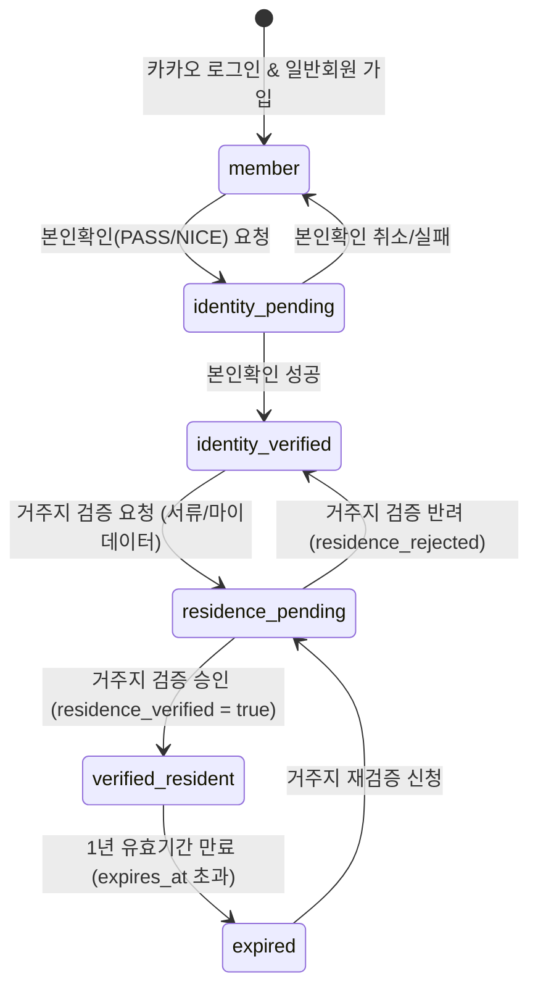

# 영광군의회 「열린소통 ON」 V4-5 군민인증 아키텍처 및 운영 모델 청사진

---

## 1. 아키텍처 개요 및 핵심 원칙

영광군의회 「열린소통 ON」 플랫폼은 군민 중심의 의정 소통을 실현하기 위해 **본인확인(Identity Verification)**과 **거주지확인(Residence Verification)**을 엄격히 분리한 2단계 인증 체계를 채택합니다.

> **💡 핵심 원칙**:
> 1. **카카오 로그인 ≠ 군민인증**: 소셜 로그인은 간편 로그인 및 세션 수립 수단일 뿐, 영광군민 자격을 자동 부여하지 않습니다.
> 2. **본인확인(PASS/NICE) ≠ 거주지 증명**: PASS/NICE는 본인 식별 수단이며, 주민등록상 영광군 거주 여부는 별도의 거주지 검증 절차를 거칩니다.
> 3. **개인정보 최소 수집**: 주민등록번호 원문, CI/DI 원문 등 민감 정보는 절대 저장하지 않으며, 단방향 해시(`provider_subject_hash`) 및 최소 승인 메타데이터만 보관합니다.
> 4. **유효기간 1년 방어**: 거주지 변경 가능성에 대비하여 1년 유효기간(`expires_at`)을 적용하고, 만료 시 재검증 절차를 거칩니다.

---

## 2. 사용자 인증 6단계 상태 정의 (User State Lifecycle)

| 상태 (State) | 설명 | 권한 범위 (Access Control) |
| :--- | :--- | :--- |
| **1) anonymous** | 비로그인 방문자 | 공개 안건/소통/성과 조회 (READ 전용) |
| **2) authenticated** | 카카오 소셜 로그인 성공 회원 | 로그인 세션 수립 (프로필 미등록 상태) |
| **3) member** | 열린소통 ON 일반회원 등록 완료 | 공개 콘텐츠 READ, 성과 보기, SNS 공유 |
| **4) identity_verified** | PASS/NICE 휴대폰 본인확인 완료 | 본인 식별 완료 (거주지 미검증 상태) |
| **5) residence_verified** | 영광군 거주 사실 검증 완료 | 거주지 검증 완료 (본인확인 미검증 상태) |
| **6) verified_resident** | **identity_verified AND residence_verified** | **영광군민 최종 자격 획득** (투표, 제안, 공감, 댓글 WRITE 전면 허용) |

---

## 3. PASS / NICE 본인확인 서비스 역할 정의

- **역할**: 휴대폰 명의자 확인을 통한 **실명 식별 (identity_verified)**
- **제공 데이터**: 이름, 생년월일, 성별, 휴대전화번호, CI/DI (암호화된 연계정보)
- **한계점**: PASS/NICE는 주민등록상 실거주지(영광군 여부) 정보를 제공하지 않음.
- **도입 특성**: 공공기관 계약 수수료 방식 (건당 과금, 연간 계약), 테스트 샌드박스 환경 활용.

---

## 4. 거주지 확인 방식 4대 후보 비교 분석

| 비교 항목 | A. 행정정보 공동이용 / 공공 마이데이터 | B. 주민등록등초본/운전면허 | C. 영광군 행정DB direct 연계 | D. 사용자 서류 제출 + 관리자 승인 |
| :--- | :--- | :--- | :--- | :--- |
| **실행 가능성** | 중 (행안부 연계 승인 필요) | 중 (전자문서지갑/OCR 연계) | 하 (영광군 전산망 보안 협의) | **상 (즉시 시연 및 운영 가능)** |
| **실시간성** | 실시간 (API) | 실시간 (API) | 실시간 (DB) | 수동 승인 (1~24시간 소요) |
| **개발 난이도** | 높음 | 보통 | 높음 | **낮음** |
| **초기 도입비용** | 시스템 구축비 필요 | 솔루션 도입비 필요 | 전산망 연계비 필요 | **최소 비용** |
| **개인정보 위험** | 중 (정부 표준 프로토콜) | 중 (이미지 보안 암호화) | 높음 (행정망 직접연결) | **최소화 (검증 후 파일 즉시 삭제)** |
| **영광군의회 납품 현실성** | 장기 과제 | 중기 과제 | 장기 과제 | **최우선 권장 (1단계)** |

---

## 5. 시연용(Demo) vs 실서비스(Production) 운영 모델 분리

```
┌─────────────────────────────────────────────────────────────────────────┐
│                       [1단계: 저비용/시연형 운영 모델]                     │
├─────────────────────────────────────────────────────────────────────────┤
│  • 카카오 로그인 ➔ PASS/NICE 테스트 샌드박스 ➔ 관리자 수동 승인 / Mock    │
│  • 신속한 시연 및 데모 구축에 최적화, 감사로그 기록 수립                  │
└─────────────────────────────────────────────────────────────────────────┘
                                   │
                                   ▼
┌─────────────────────────────────────────────────────────────────────────┐
│                       [2단계: 현실적 초기 운영 모델]                      │
├─────────────────────────────────────────────────────────────────────────┤
│  • PASS/NICE 실제 본인확인 API + 서류 제출 (관리자 24시간 내 승인/거절)   │
│  • 개인정보 서류 검증 즉시 자동 영구 파기 (Privacy by Design)           │
└─────────────────────────────────────────────────────────────────────────┘
                                   │
                                   ▼
┌─────────────────────────────────────────────────────────────────────────┐
│                       [3단계: 완전 자동화 실서비스 모델]                  │
├─────────────────────────────────────────────────────────────────────────┤
│  • 행정정보 공동이용망 / 공공 마이데이터 연계 자동 거주지 검증           │
│  • 100% 실시간 자동 인증 처리 및 1년 유효기간 자동 갱신 알림            │
└─────────────────────────────────────────────────────────────────────────┘
```

---

## 6. DB `resident_verifications` 상태 전이 다이어그램



---

## 7. 유효기간 및 개인정보 보호 정책

1. **거주지 유효기간**: **1년 (365일)**
   - `expires_at = residence_verified_at + INTERVAL '1 year'`
   - 만료 시 `residence_status = 'expired'`로 자동 전환되며, 거주지 재검증을 유도합니다.
2. **개인정보 최소 수집 원칙 (Privacy by Design)**:
   - 주민등록번호, CI, DI 원문 **절대 DB 저장 금지**.
   - `provider_subject_hash`: `SHA-256(DI + SALT)` 형태로 단방향 해시 처리하여 동일인의 타 계정 중복 가입 판별에만 활용.
   - 제출 서류 파일: 승인/거절 즉시 암호화 파기.

---

## 8. 11개 읍면 매핑과 군민 자격 판정 분리

- **군민 자격 판정**: 주민등록상 **전라남도 영광군** 거주 여부만으로 `verified_resident` 자격 부여.
- **11개 읍면 연결 (`region_id`)**:
  - 영광읍, 백수읍, 홍농읍, 대마면, 묘량면, 불갑면, 군서면, 군남면, 염산면, 법성면, 낙월면.
  - 읍면 정보는 군민 소통지도, 지역별 안건 통계 분석, 관할 의원 소통용으로만 활용하며 자격 제한 요소로 사용하지 않음.

---

## 9. 기능 권한 매핑 표 (Role-Based Access Control)

| 기능 구분 | anonymous | member (미인증 일반회원) | verified_resident (영광군민) | admin / council_staff |
| :--- | :---: | :---: | :---: | :---: |
| 안건/제안/성과 조회 (READ) | O | O | O | O |
| 묻습니다 투표 (WRITE) | X | X | **O** | **O** |
| 듣습니다 제안 등록 (WRITE) | X | X | **O** | **O** |
| 공감 / 댓글 작성 (WRITE) | X | X | **O** | **O** |
| 관리자 승인 및 통계 관리 | X | X | X | **O** |

---

## 10. 보안 위협 모델 (Security Threat Matrix & Defenses)

| 위협 시나리오 | 위험도 | 방어 기제 (Mitigation Strategy) |
| :--- | :---: | :--- |
| **1) 타인 명의 휴대폰 인증** | 고 | PASS/NICE 본인확인 명의와 서류/계정 일치 여부 검증 |
| **2) 카카오 다중 계정 생성** | 중 | `provider_subject_hash` UNIQUE 제약조건으로 1인 1계정 제한 |
| **3) 인증 후 타 지역 전입** | 중 | 1년 유효기간(`expires_at`) 및 정기 거주지 재검증 |
| **4) 관리자 승인 오남용** | 고 | `audit_logs` 테이블에 승인자, 일시, 근거 사유 필수 기록 |
| **5) Client-side 상태 조작** | 고 | RLS 및 `SECURITY DEFINER` RPC에서 DB 직접 검증 (Client state 무시) |
| **6) API Replay / forgery** | 고 | CSRF 토큰, OAuth state 파라미터, Supabase Session Token 검증 |

---

## 11. 영광군의회 최종 권장 운영안

👉 **"제2안: 현실적 초기 운영형 (PASS/NICE API + 서류/관리자 승인 모델)"**

---

## 12. PRODUCTION CUTOVER CHECKLIST (실서비스 배포 전 필수 이행 사항)

실제 영광군의회 오픈 서비스(Production) 전환 시 반드시 제거하거나 보강해야 하는 이행 점검 항목입니다:

- [ ] **1. `public.demo_verify_identity` RPC 제거/비활성화**:
  - `DROP FUNCTION IF EXISTS public.demo_verify_identity(UUID);` 실행 또는 `REVOKE EXECUTE FROM authenticated;` 처리.
- [ ] **2. PASS / NICE 실제 본인확인 PG 연동**:
  - `VerificationClient.tsx` 내 시연용 팝업 버튼을 실제 PASS/NICE PG SDK/API 호출로 교체.
- [ ] **3. 거주지 검증 방식 최종 확정**:
  - 공공 마이데이터 / 행정정보 공동이용망 연계 또는 서류 검증 자동 영구 파기 스크립트 가동.
- [ ] **4. `provider_subject_hash` UNIQUE 제약조건 적용**:
  - CI/DI 단방향 해시 수집 정책 확정 후 `ALTER TABLE resident_verifications ADD CONSTRAINT unique_provider_subject_hash UNIQUE (provider_subject_hash);` 적용.
- [ ] **5. 시연용 DB 테스트 데이터 초기화**:
  - 시연 과정에서 발생한 Test Verification Row 및 Audit Logs 정리.
- [ ] **6. 개인정보 처리방침 반영 및 1년 유효기간 자동 알림**:
  - 1년 유효기간(`expires_at`) 도달 30일 전 자동 재검증 안내 서비스 구축.
